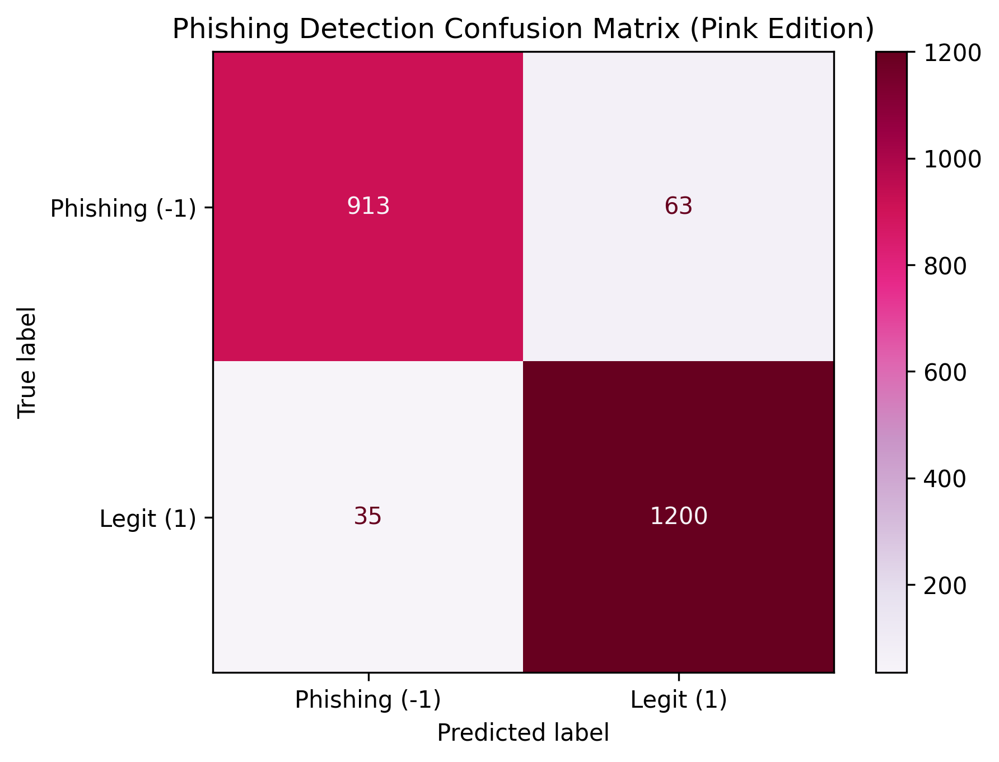

# AI Phishing Detector

An AI-powered phishing detection system built using ensemble machine learning models. This project analyzes website metadata and predicts whether a URL is legitimate or a phishing attempt, with over 95% accuracy.

---

## Overview

This project demonstrates the use of supervised machine learning to detect phishing websites using a dataset sourced from Kaggle. It uses two base models — Logistic Regression and Random Forest — combined into an ensemble classifier to increase accuracy and reliability.

---

## Features

- Detects phishing vs. legitimate websites
- Ensemble model: Logistic Regression + Random Forest
- Pink-themed confusion matrix for visual analysis 
- Scalable, modular codebase with clean function separation
- Accuracy score, classification report, and visual output

---

## Technologies Used

- **Python**
- **Pandas** – data manipulation
- **Scikit-learn** – machine learning algorithms
- **Matplotlib** – data visualization
- **VotingClassifier** – for ensemble learning

---

## Skills Demonstrated

- Building ensemble ML models from scratch
- Feature scaling and preprocessing techniques
- Model evaluation using confusion matrices and classification reports
- Structuring Python projects into clean, reusable functions
- Using `.gitignore` to manage sensitive/local files
- Version control with Git + GitHub

---

## How It Works

1. Loads and preprocesses phishing dataset
2. Splits into training and testing sets
3. Scales feature data using `StandardScaler`
4. Trains an ensemble model (soft voting classifier)
5. Evaluates model with accuracy score, confusion matrix, and report
6. Displays results via terminal + pink-themed visual

> Dataset used: [Phishing Website Detector (Kaggle)](https://www.kaggle.com/datasets/eswarchandt/phishing-website-detector)

> Note: To run this project, download `phishing.csv` from the link above and place it in the same directory as the Python script.

---

## Results

- **Final Accuracy**: ~95.7%
- **Classification Report**: Includes precision, recall, F1-score
- **Visual Analysis**: Confusion matrix with styled visualization

---

## Results Visualization

Confusion matrix for the model (pink-themed):

---

## Future Improvements

- Deploy the model via Flask or Streamlit for web input
- Accept live URLs and perform real-time checks
- Experiment with deep learning or NLP for phishing email content
- Integrate threat intelligence feeds for smarter detection

